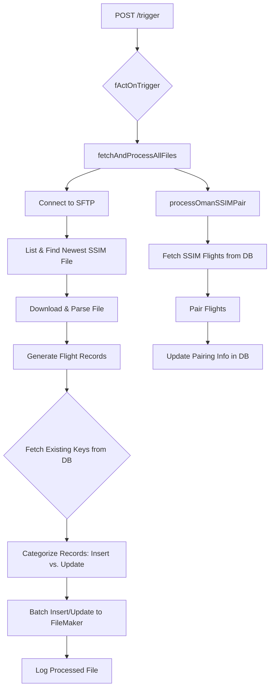

# SSIM Data Synchronization Process

## 1. Overview

This document outlines the end-to-end process for fetching, parsing, and synchronizing Standard Schedules Information Manual (SSIM) data from an SFTP server into the FileMaker database. The process is designed to be robust, resilient, and efficient, handling large volumes of flight data while maintaining data integrity.

The entire workflow is orchestrated by the `fetchAndProcessAllFiles` function, which is triggered via a REST API endpoint.

## 2. Process Trigger and Data Flow

### 2.1. Triggering the Process

The SSIM sync process is initiated by an external system making a POST request to the `/trigger` endpoint of the application's REST API.

- **API Request**: A POST request is sent to `/trigger` with a JSON body containing `{"asFunctions": ["OmanSSIM"]}`.
- **Request Queueing**: The REST server (`004_RESTServer.ts`) immediately intercepts this request. A middleware layer checks if another sync process is already running (`bIsBusy`). If it is, the request is rejected to prevent concurrent runs.
- **Background Execution**: If the server is idle, it immediately sends a 200 OK response to the caller and then starts the `fActOnTrigger` function in the background.
- **Function Dispatch**: `fActOnTrigger` acts as a dispatcher, sees the `"OmanSSIM"` instruction, and calls `await fetchAndProcessAllFiles('/Oman/SSIM/')`.

### 2.2. Data Flow Diagram

The following diagram illustrates the high-level flow of data from the SFTP server to the FileMaker database.

## 3. Deep Dive: fetchAndProcessAllFiles Function

This function is the core of the SSIM synchronization logic. It's a robust, multi-stage process designed for data integrity and performance.

### Step 1: SFTP Connection and File Discovery

- **Connection**: Establishes a connection using credentials stored in `oConfigEntry`.
- **File Filtering and Sorting**:
  - Lists all files in the given SFTP path (e.g., `/Oman/SSIM/`).
  - Filters this list to keep only files matching the pattern `prod_wy_ssim_*.txt`.
  - Sorts the filtered list by `modifyTime` in descending order.
  - Selects only the first element (`ssimFiles[0]`), ensuring that only the single most recent SSIM file is processed.

### Step 2: Parsing the SSIM Data (`parseSSIMData`)

- **Line-by-Line Processing**: Splits the file content by newlines and iterates through each line.
- **Record Type Filtering**: Processes only lines starting with `"3"`, the standard identifier for a flight leg in SSIM format.
- **Data Extraction**: Extracts fields like `flightDesignator`, `departureStation`, `scheduledDepartureTime`, etc., into a `FlightRecord` object using fixed-width substring operations.
- **Flight Number Validation**: Filters out flights not matching Oman Air's flight number patterns (e.g., must be 4-digit or match `WY[237]XXX`).

### Step 3: Transformation into Database Records (`generateFlightsTableRecords`)

- **Date Range Expansion**: Expands schedule periods (e.g., 01JAN25–31MAR25) into individual daily flights based on operating days.
- **Timestamp Calculation (`convertToUTCAndLocal`)**:
  - Converts local time and UTC offset into precise UTC and local timestamps.
  - Handles overnight flights (arrival time earlier than departure → increment date).
- **Sync Key Generation**: Creates `SyncKeyWithDest_s` (e.g., `2025-09-27|WY101|MCT`) as a unique identifier.
- **Filtering**: Discards records outside global `START_DATE` and `END_DATE` constants.

### Step 4: Intelligent Database Synchronization

- **Fetch Existing Keys**: Retrieves existing `SyncKeyWithDest_s` values for both `ASM` and `SSIM` sources. Stored in sets for fast lookup.
- **Categorize Records**:
  - `recordsToInsert`: Keys not in ASM or SSIM sets.
  - `recordsToUpdate`: Keys in SSIM set but not ASM (ASM is authoritative).
- **Batch Processing**:
  - Inserts/updates in batches of 100.
  - Pre-emptive duplicate check before batch insert.
  - Concurrent execution with `Promise.all`.
  - Fallback retry (up to 3 times with exponential backoff) on failure.
- **Logging & Verification**:
  - Logs processed filename in `FLIGHTSSIMUPDATEFILE` table.
  - Verifies sample records after each batch.

## 4. Subsequent Step: processOmanSSIMPair

After `fetchAndProcessAllFiles` completes, `fActOnTrigger` calls `processOmanSSIMPair`:

- Fetches newly inserted/updated SSIM flights from DB.
- Applies business logic to link flights into pairs/multi-leg journeys.
- Updates `__id2_Flight_FirstInPairOrGroup` and `PositionInPairOrGroup_s` fields in FileMaker.
