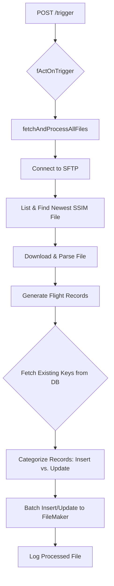

# SSIM Data Synchronization Process

## 1. Overview

This document outlines the end-to-end process for fetching, parsing, and synchronizing Standard Schedules Information Manual (SSIM) data from an SFTP server into the FileMaker database. This process is designed to be robust and efficient, handling large volumes of flight data while maintaining data integrity.

The entire workflow is orchestrated by the `fetchAndProcessAllFiles` function, which is triggered via a REST API endpoint. It connects to an SFTP server, downloads the latest schedule file, transforms the raw data into individual flight records, and intelligently synchronizes them with the database.

## 2. Process Trigger and Data Flow

### 2.1. Triggering the Process

The SSIM sync process is initiated by an external system making a POST request to the `/trigger` endpoint of the application's REST API.

- **API Request**: A POST request is sent to `/trigger` with a JSON body containing `{"asFunctions": ["OmanSSIM"]}`.
- **Request Queueing**: The REST server (`004_RESTServer.ts`) intercepts this request. A middleware layer checks if another sync process is already running (`bIsBusy`). If it is, the request is rejected to prevent concurrent runs.
- **Background Execution**: If the server is idle, it immediately sends a `200 OK` response to the caller and then starts the `fActOnTrigger` function in the background.
- **Function Dispatch**: `fActOnTrigger` sees the `"OmanSSIM"` instruction and calls `await fetchAndProcessAllFiles('/Oman/SSIM/')`.

### 2.2. Data Flow Diagram

The following diagram illustrates the flow of data from the SFTP server to the FileMaker database.

## 3. Deep Dive: fetchAndProcessAllFiles Function

### Step 1: SFTP Connection and File Discovery

- **Connection**: The function begins by connecting to the SFTP server using credentials stored in the application's configuration (`oConfigEntry`).
- **File Discovery**:
  - It lists all files in the specified SFTP path (e.g., `/Oman/SSIM/`).
  - It filters this list to find files matching the pattern `prod_wy_ssim_*.txt`.
  - The results are sorted by modification time in descending order, ensuring the newest file is first.
  - It selects only the first element from the sorted list (`ssimFiles[0]`) to process the single, most recent SSIM file.

### Step 2: Parsing Raw SSIM Data (`parseSSIMData`)

- The downloaded file content, a raw string, is passed to this helper function to be converted into structured `FlightRecord` objects.
- **Record Type Filtering**: Only considers lines that start with `"3"`, which is the SSIM flight leg identifier.
- **Business Rule Filtering**:
  - Checks for "normal" flights (e.g., `WY0001` to `WY0999`).
  - If outside this range, checks against regex `/^WY[237]\d{3}$/` (valid: `WY2XXX`, `WY3XXX`, `WY7XXX`). Others are skipped.
- **Fixed-Width Extraction**: Uses `substring()` with hardcoded positions to extract fields (e.g., `departureStation`, `scheduledDepartureTime`).
- **Final Validation**: Ensures `scheduledDepartureTime` and `scheduledArrivalTime` are valid HHmm strings. Invalid ones are skipped.

### Step 3: Transformation into Database Records (`generateFlightsTableRecords`)

- **Date Range Expansion**: Expands a schedule period (e.g., `01JAN25` → `31MAR25`) across specific operating days (`1234567` for daily).
- **Global Date Filtering**: Discards records outside global `START_DATE` and `END_DATE` constants.
- **Timestamp Calculation (`convertToUTCAndLocal`)**:
  - Converts local time (e.g., `1105`) and UTC offset (`+0400`) into precise UTC and local timestamps.
  - **Overnight Flight Logic**: If arrival time is earlier than departure in UTC, increments arrival date by 1.
- **Sync Key Generation**: Creates unique `SyncKeyWithDest_s` (`YYYY-MM-DD|FlightNumber|DepartureStation`).
- **Duplicate Prevention**: Uses a `Set (seenKeys)` to avoid duplicates in the same file.

### Step 4: Intelligent Database Synchronization

- **Fetch Existing Keys**: Retrieves existing primary keys (`SyncKeyWithDest_s`) for both ASM and SSIM data.
- **Categorize Records**:
  - **Insert**: If key not in `asmExistingIds` or `ssimExistingIds`.
  - **Update**: If key exists in `ssimExistingIds` but not in `asmExistingIds` (ASM has higher authority).
- **Batch Processing**:
  - Inserts/updates in batches of 100 for efficiency.
  - **Pre-emptive Duplicate Check**: Validates before insertion to avoid race conditions.
  - **Concurrent Execution**: Uses `Promise.all` for speed.
  - **Fallback with Retries**: On failure, retries one-by-one with exponential backoff (max 3 retries).
- **Logging and Verification**:
  - Records processed filename in `FLIGHTSSIMUPDATEFILE` table.
  - After each batch, queries sample records to verify successful writes.
