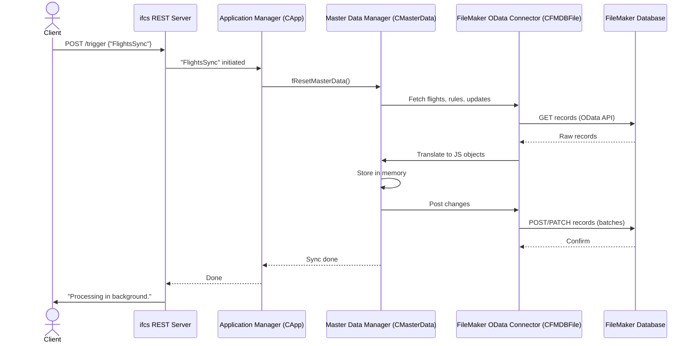

# FileMaker Data Integration & Master Data Management

here we get introduced to **FileMaker Data Integration & Master Data Management**, which you can think of as a highly skilled **translator and librarian** that specializes in FileMaker data.

---

## Why Does `ifcs` Need This?

For now imagine FileMaker as a **vault** of structured airline data — flights, rules, updates. To keep operations running smoothly, `ifcs` needs to:

1. **Understand FileMaker’s “language”** → FileMaker uses OData; `ifcs` uses JavaScript.
2. **Read data from FileMaker** → flights, business rules, existing updates.
3. **Process that data** → apply rules, calculate statuses, create new updates.
4. **Write results back** → ensure FileMaker’s vault is always up-to-date.
5. **Keep a master copy in memory** → so all `ifcs` modules share a consistent, reconciled truth.

Without this translator/librarian layer, `ifcs` couldn’t communicate effectively with FileMaker or keep its data consistent.

---

## Key Concepts

- **FileMaker OData API** → the “language” used to talk with FileMaker.
- **CFM Objects** (e.g., `CFMFlight`) → FileMaker’s records, shaped for FileMaker’s schema.
- **CJS Objects** (e.g., `CJSFlight`) → internal JavaScript representations for `ifcs`.
- **Property Mappings** → translation rules between FileMaker fields and `ifcs` objects.
- **CMasterData** → the in-memory **library** holding the master truth while `ifcs` is running.
- **Batching** → efficient bulk reads/writes instead of one-by-one operations.

---

## Example: Flight Synchronization

Suppose you trigger a flight sync:

```bash
curl -X POST http://localhost:3000/trigger -H "Content-Type: application/json" -d '{"asFunctions": ["FlightsSync"]}'
```

Here’s what happens:

1. **Read** → `ifcs` fetches flights and rules from FileMaker.
2. **Translate** → FileMaker records become `CJSFlight` and `CJSRule` objects.
3. **Store** → these objects are placed in the `CMasterData` “library.”
4. **Process** → business logic updates flights or creates new ones.
5. **Compare** → changed/new flights are identified against a “before” snapshot.
6. **Translate Back** → updates are converted into FileMaker’s `CFM` objects.
7. **Write in Batches** → changes are sent efficiently to FileMaker via the OData API.

This keeps FileMaker’s vault **always synchronized** with `ifcs`’s processed results.

---

## Data Journey (Visual)



---

## Under the Hood

### 1. FileMaker Connector (`101_FMDB.ts`)

- `CFMDBFile` handles the OData connection.
- `CFMFlight` and other `CFM*` classes represent FileMaker’s schema.
- Supports:
  - `foResponseFromRecordODataRequest()` → single GET/POST/PATCH/DELETE
  - `fToFMODataWithBatching()` → batch operations with `multipart/mixed` requests

### 2. Internal Data Models (`100_Data.ts`)

- `CJSFlight`, `CJSRule`, etc. represent data inside `ifcs`.
- `PropertyMappings` define how to translate fields both ways.
- `ACJSRecord` base class implements the core translation logic.

Example: `CJSFlight` ↔ `CFMFlight`

- Maps simple fields (`sStatus`, `sAircraftRegistration`)
- Handles complex transformations (e.g., scheduled UTC timestamps, nested destinations)

### 3. Master Data (`CMasterData`)

- Holds **before & after** states of flights.
- Detects new or updated records.
- Posts changes back to FileMaker efficiently.
- Resets itself after each cycle to stay clean.

---

## Why This Matters

- **Consistency** → everyone in `ifcs` uses the same master data snapshot.
- **Performance** → batching avoids slow one-by-one requests.
- **Resilience** → translation layer isolates FileMaker-specific quirks from business logic.
- **Scalability** → adding new data sources (besides FileMaker) is easier because `ifcs` already abstracts the translation.

---
