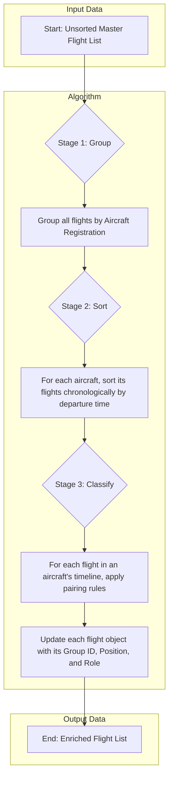

# Flight Pairing Logic Documentation

## 1. Overview

The primary goal of the **Flight Pairing** process is to analyze a large, unsorted list of flights and group them into logical operational sequences or **"tours of duty"** for each individual aircraft.

A sequence begins when an aircraft departs from a designated **home base** airport and ends when it returns to a home base or its operational sequence is broken.  
This process is essential for downstream operations such as catering, crew scheduling, and maintenance planning.

The algorithm takes raw flight data and enriches it by adding three key pieces of information to each flight record:

- **Group ID**: A reference to the first flight in its sequence.
- **Position**: The numerical order of the flight within the sequence (e.g., 1st, 2nd, 3rd).
- **Role**: A classification of the flight's role in the sequence (e.g., First, Middle, Last, Solo).

---

## 2. Prerequisites

Before the pairing logic can execute, two critical pieces of data must be prepared:

- **Master List of Flights (`moMasterFlightsProcessing`)**:  
  A collection of all relevant flight objects for a given time period.

- **List of Home Base Airports (`aoAirlineHomeDestinations`)**:  
  A client-specific array of airport codes (e.g., `["MCT", "SLL"]`) that are considered operational hubs.  
  This list is the cornerstone of the entire pairing logic.

---

## 3. The High-Level Flow

The pairing process is executed in three main stages: **Group, Sort, and Classify**.

### Stage 1 & 2: Group and Sort

The first step is preparatory. The algorithm reorganizes the master list of flights into a more useful structure:

1. **Sort All Flights**: The entire list of flights is sorted chronologically by their UTC departure time.
2. **Group by Aircraft**: The sorted list is processed into a `Map`, where each key is a unique `sAircraftRegistration` and the value is an array of all flights for that aircraft, already sorted in chronological order.

This creates a clean, ordered timeline of operations for each individual aircraft, which is essential for the next stage.

---

### Stage 3: Classify (The Core Logic)

This is the heart of the algorithm. It iterates through each aircraft's sorted timeline and applies rules to determine each flight's role.

#### The Core Pairing Rules:

1. **Home Base Rule**:  
   A flight departing from a designated home base airport always starts a new sequence.  
   It is classified as **First** or **Solo**.

2. **Continuity Rule**:  
   A flight whose departure airport matches the previous flight’s arrival airport is considered a continuation of the current sequence.  
   It is classified as **Middle** or **Last**.

If neither of these rules applies, the sequence is broken, and the flight starts a new sequence.

#### Classification Outcomes:

- **First**: The flight departs from a home base and is followed by at least one connecting flight.
- **Middle**: The flight is a continuation of a sequence and is also followed by a connecting flight.
- **Last**: The flight is a continuation of a sequence, but the next flight either doesn’t exist or starts a new sequence.
- **Solo**: The flight departs from a home base, but no continuation exists.
- **Unknown**: Data is incomplete, or it represents an edge case (e.g., a flight mid-sequence appearing without a preceding "First").

---

## 4. Data Output

After processing, every flight object in the master list will include three enriched fields, ready to be saved back to the database:

| Field Name                       | Type   | Description                                           | Example    |
| -------------------------------- | ------ | ----------------------------------------------------- | ---------- |
| `_id2_Flight_FirstInPairOrGroup` | `TId`  | The database ID of the first flight in the sequence   | `201`      |
| `iPositionInPairOrGroup`         | number | The numerical position of this flight in the sequence | `2`        |
| `ePositionInPairOrGroup`         | string | The role of the flight, as determined by the rules    | `"Middle"` |
