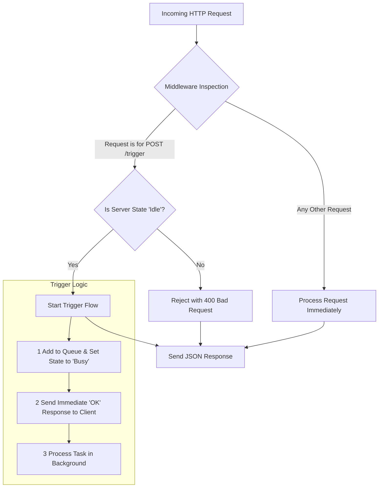

# IFCS GalleyXHelper — REST Server High-Level Flow

**Purpose:** This document provides a concise, well-organized overview of the `004_RESTServer.ts` file: its architecture, request handling, and the flow for the main long-running task endpoint (`/trigger`).

---

## Table of Contents

1. [Core Purpose](#core-purpose)
2. [Server States](#server-states)
3. [General Request Flow](#general-request-flow)
4. [Key Endpoints](#key-endpoints) Q
   - [/trigger (POST)](#the-trigger-endpoint-post)
   - [/state (GET)](#the-state-endpoint-get)
   - [/merge-pdf (POST)](#the-merge-pdf-endpoint-post)
5. [Notes & Best Practices](#notes--best-practices)
6. [Example TypeScript Pseudocode](#example-typescript-pseudocode)

---

## Core Purpose

The REST server acts as the main entry point for external systems to interact with the application. Its primary responsibilities are:

- **Monitoring:** Provide simple endpoints to check server health and current state.
- **Task Triggering:** Expose a robust endpoint (`/trigger`) to initiate long-running, asynchronous data processing tasks.
- **Concurrency Control:** Ensure only one long-running task runs at a time (prevent race conditions & data corruption).
- **Utilities:** Offer helper endpoints for specific tasks (e.g., merging PDFs).

---

## Server States

The server operates in one of two states, which dictates how it handles incoming `/trigger` requests:

- **Idle** — Server is not performing background tasks and is ready to accept a new `POST /trigger` request.
- **Busy** — Server is actively processing a background task. Any new `POST /trigger` requests received while Busy will be rejected with `400 Bad Request`.

---

## General Request Flow

Every incoming request passes through middleware which routes logic based on the request path.



**Summary:** Non-`/trigger` requests are handled immediately. `POST /trigger` requests require the server to be `Idle`; if so, the server sets state to `Busy`, responds immediately to the client, and processes the request asynchronously in the background.

---

## Key Endpoints

### The `/trigger` Endpoint (POST)

This is the main endpoint to kick off long-running background work. It is asynchronous and flexible.

**Example request body (JSON):**

```json
{
  "asFunctions": ["FlightsSync", "FlightsPair"]
}
```

**Flow of a successful trigger:**

1. **Request Received** — `POST /trigger` arrives with a JSON body listing functions to run (or an empty array to run all tasks).
2. **State Check** — Middleware confirms the server is `Idle`.
3. **State Change** — Server immediately sets its state to `Busy` (acts as a lock).
4. **Immediate Response** — Respond `200 OK` with message:
   ```json
   { "message": "Trigger received. Processing in background." }
   ```
   The client does not wait for the work to finish.
5. **Background Processing** — The server starts executing `fActOnTrigger` in the background. Inside it, tasks are dispatched according to `asFunctions` (e.g., `oClient.fSyncFlights`, `oClient.fPairFlights`). If `asFunctions` is empty, run all predefined tasks.
6. **Task Completion** — After all tasks finish, server sets state back to `Idle` and becomes ready for the next trigger.

**Flow of a rejected trigger (when server `Busy`):**

- Incoming `POST /trigger` -> middleware sees state is not `Idle` -> immediately respond `400 Bad Request` with:

```json
{ "message": "Server is not idle. Request ignored." }
```

---

### The `/state` Endpoint (GET)

Simple monitoring endpoint returning current server status.

**Example success response (Busy state):**

```json
{
  "sStatus": "OK",
  "eState": "busy",
  "iPendingRequests": 0,
  "d": "2025-09-08T04:43:20.789Z"
}
```

Fields:

- `sStatus`: general status (e.g., `"OK"`).
- `eState`: `"idle"` or `"busy"`.
- `iPendingRequests`: number of queued requests (normally `0` under current design since extra triggers are rejected).
- `d`: timestamp (ISO 8601).

---

### The `/merge-pdf` Endpoint (POST)

A utility endpoint independent of the main trigger flow.

- **Purpose:** Accepts an array of base64-encoded PDF strings and merges them into a single PDF.
- **Memory optimization:** Merge in chunks to conserve memory when handling many/large PDFs.
- **Response:** Returns JSON with the merged PDF as a base64 string, e.g.:

```json
{
  "mergedPdfBase64": "JVBERi0xLjQKJc..."
}
```

**Notes:** This endpoint should be implemented to avoid interfering with `fActOnTrigger` state (i.e., it can run while the server is Busy, because it is a standalone utility). If desired, add rate-limiting or size checks to prevent excessive memory use.

---
