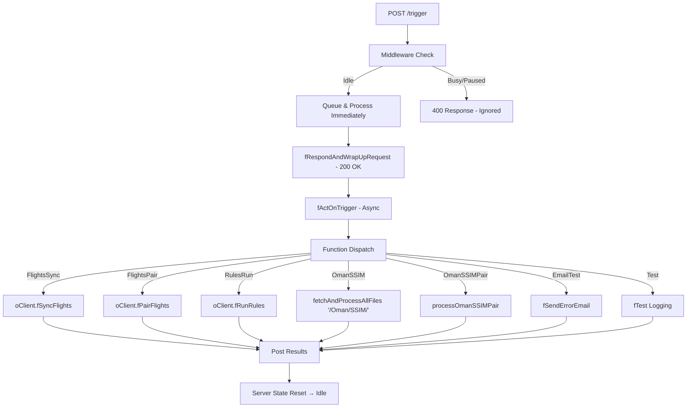

# `/trigger` Endpoint – Execution Flow

## 1. Overview

The `/trigger` endpoint is the entry point for orchestrating various background processes such as flight synchronization, pairing, rules execution, and SSIM ingestion.

It is designed with:

- **Queueing logic** to avoid race conditions or concurrent executions.
- **State management** (Idle, Busy, Paused, Busy & Paused).
- **Background execution** so API clients get an immediate acknowledgment.
- **Granular function dispatch** based on the `asFunctions` parameter in the request body.

---

## 2. Request and Response Flow

### 2.1 API Request

- **Method**: `POST /trigger`
- **Body**:
  ```json
  {
    "asFunctions": ["OmanSSIM", "FlightsSync"],
    "aiFlightIds": [123, 456]
  }
  ```
  - `asFunctions`: Optional array of process identifiers (e.g., `FlightsSync`, `OmanSSIM`, etc.).
    - If empty or not provided → all processes run.
  - `aiFlightIds`: Optional array of flight IDs to scope processing.

---

### 2.2 Middleware & Queue Handling

When a request hits `/trigger`, it passes through middleware configured in `fServerSetMiddleWare()`:

1. **Non-trigger requests** → bypass queueing, processed immediately.
2. **Trigger requests**:
   - If already dequeued → continue processing.
   - If **server is idle**:
     - Request is queued (`fAddRequestToQueue`).
     - Queue is processed immediately (`fProcessQueue`).
   - If **server is busy or paused**:
     - Responds with `400 Bad Request` and message:  
       `"Server is not idle. Request ignored."`

---

### 2.3 Immediate API Response

The `/trigger` handler **always responds immediately**:

```json
{
  "d": "2025-09-30T12:00:00.000Z",
  "sStatus": "OK",
  "sMessage": "Trigger received. Processing in background.",
  "eState": "busy",
  "iPendingRequests": 0
}
```

> **Note**: The actual work happens **asynchronously in the background** after the response.

---

## 3. Background Execution: `fActOnTrigger`

Once dequeued, the request is processed by `fActOnTrigger`, which orchestrates multiple sub-tasks.

### 3.1 Initialization

- Resets config and date range (`fResetDStartFromAndDEndAt`).
- Ensures timezone offsets are set for OData fields.
- Marks server state as `busy`.

---

### 3.2 Function Dispatch

For each requested function in `asFunctions`, conditional logic routes execution:

- **FlightsSync**
  - Resets master data (`fResetMasterData`).
  - Calls `oClient.fSyncFlights`.
  - Posts results back (`fPostResults`).
- **FlightsSyncAbove72**
  - Similar to `FlightsSync`, but with a **180-day future cutoff**.
- **FlightsPair**
  - Runs `oClient.fPairFlights`.
- **RulesRun**
  - Runs `oClient.fRunRules`.
- **OmanSSIM**
  - Calls `fetchAndProcessAllFiles('/Oman/SSIM/')`.
- **OmanSSIMPair**
  - Calls `processOmanSSIMPair()`.
- **(Optional/Commented) SalamSSIM / SalamSSIMPair**
  - Prepared hooks for Salam Air, currently disabled.
- **EmailTest**
  - Generates a simulated error and sends a test error email.
- **Test**
  - Runs a lightweight logging test.

---

### 3.3 Completion

- Server state is reset: `bIsPaused = false`, `bIsBusy = false`.
- Logs `server is idle`.

---

## 4. Data Flow



## 5. Key Design Decisions

- **Queued Execution**: Prevents multiple `/trigger` requests from overlapping.
- **Background Processing**: Keeps the API responsive.
- **Extensible Dispatch**: Easy to add new function handlers via `fbFunctionIsIncluded`.
- **Robust Logging**: Start/end markers, error logs, and state transitions for visibility.
